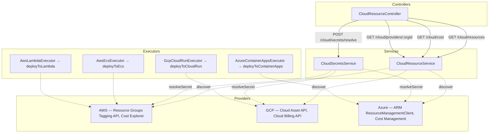

# Cloud Integrations

This document describes the architecture of the `CloudModule` for contributors and developers extending Farm's cloud provider support.

## Module Location

```text
apps/api/src/modules/cloud/
  aws/
    aws.service.ts            — AWS SDK interactions (discovery, cost, ECS, Lambda, Secrets Manager)
    aws.service.spec.ts
  gcp/
    gcp.service.ts            — GCP REST API interactions (Cloud Asset, Cloud Run, Secret Manager, Billing)
    gcp.service.spec.ts
  azure/
    azure.service.ts          — Azure SDK interactions (ARM, Container Apps, Key Vault, Cost Management)
    azure.service.spec.ts
  executors/
    aws-ecs.executor.ts       — Pipeline deploy executor for ECS
    aws-ecs.executor.spec.ts
    aws-lambda.executor.ts    — Pipeline deploy executor for Lambda
    aws-lambda.executor.spec.ts
    gcp-cloud-run.executor.ts — Pipeline deploy executor for Cloud Run
    gcp-cloud-run.executor.spec.ts
    azure-container-apps.executor.ts — Pipeline deploy executor for Azure Container Apps
    azure-container-apps.executor.spec.ts
  dto/
    discover-resources.dto.ts
    cloud-cost.dto.ts
    resolve-secret.dto.ts
  interfaces/
    cloud-resource.interface.ts  — CloudResource interface
  cloud.module.ts
  cloud-resource.controller.ts  — REST endpoints
  cloud-resource.service.ts     — Aggregation across providers
  cloud-cost.service.ts         — Cost-specific wrapper
  cloud-secrets.service.ts      — Secret resolution + pipeline config scanning
```

## Architecture



## Credential Storage

Cloud provider credentials are stored in the `integration_credentials` table using the `IntegrationCredential` entity defined in `modules/integrations/`. The `type` column distinguishes providers:

| `IntegrationType` enum value | Provider | Encrypted payload shape |
|---|---|---|
| `aws-iam-role` | AWS | `{ accessKeyId, secretAccessKey, region }` |
| `gcp-service-account` | GCP | `{ serviceAccountJson, projectId }` |
| `azure-service-principal` | Azure | `{ tenantId, clientId, clientSecret, subscriptionId }` |

Credentials are encrypted at rest using AES-256-GCM via `IntegrationCredentialService.encrypt/decrypt`. The encryption key is derived from `JWT_SECRET`.

Provider services call `IntegrationCredentialService.findByType(orgId, type)` at request time to resolve credentials. All methods return empty arrays or throw descriptive errors when credentials are absent — they never fail silently.

## Resource Discovery

Discovery is tag-based. Resources must carry provider-specific tags to be included:

| Provider | Tag Keys |
|---|---|
| AWS | `farm:component`, `farm.io/component` |
| GCP | `farm_component`, `farm-component` (labels) |
| Azure | `farm:component`, `farm.io/component` |

The `CloudResource` interface returned by all discovery methods:

```typescript
interface CloudResource {
  provider: 'aws' | 'gcp' | 'azure';
  resourceId: string;     // ARN, GCP full name, or Azure resource ID
  resourceType: string;   // e.g. "ecs:service", "run.googleapis.com/Service"
  name: string;
  region: string;
  tags: Record<string, string>;
  linkedComponentId?: string;  // value of the farm:component tag
}
```

`CloudResourceService.discoverAll()` calls all three providers in parallel using `Promise.allSettled`. Individual provider failures are logged and excluded from the result — the method always returns a valid array.

## Cost Visibility

`CloudCostService` delegates to `CloudResourceService.getAggregatedCost()`, which calls:

- **AWS** — `CostExplorerClient.GetCostAndUsage` grouped by `farm:environment` tag
- **GCP** — Cloud Billing API (returns placeholder data when BigQuery export is not configured)
- **Azure** — `CostManagementClient.query.usage` grouped by `farm:environment` tag

The response is `ProviderCostResult[]`, one entry per provider that has cost data:

```typescript
interface ProviderCostResult {
  provider: string;
  entries: CloudCostEntry[];   // [{ environment, cost, currency, component? }]
}
```

## Pipeline Executors

The four cloud executors implement the same `execute(config, logFn)` pattern used by `HelmDeployExecutor`. They are injected into `PipelineProcessor` as `@Optional()` dependencies and dispatched by the `stage.config.engine` field:

| `engine` value | Executor | Underlying method |
|---|---|---|
| `aws-ecs` | `AwsEcsExecutor` | `AwsService.deployToEcs` |
| `aws-lambda` | `AwsLambdaExecutor` | `AwsService.deployToLambda` |
| `gcp-cloud-run` | `GcpCloudRunExecutor` | `GcpService.deployToCloudRun` |
| `azure-container-apps` | `AzureContainerAppsExecutor` | `AzureService.deployToContainerApps` |

Secret resolution via `CloudSecretsService.resolveConfigSecrets` is applied to the stage config before the executor receives it.

## Secret Resolution

`CloudSecretsService` recognizes three ref formats via static regex patterns:

| Pattern | Provider | Example |
|---|---|---|
| `^arn:aws:secretsmanager:...` | AWS Secrets Manager | `arn:aws:secretsmanager:us-east-1:123:secret:prod/db` |
| `^gcp:projects/.../secrets/.../versions/...` | GCP Secret Manager | `gcp:projects/my-project/secrets/db-pass/versions/latest` |
| `^azure:https://...:...` | Azure Key Vault | `azure:https://my-vault.vault.azure.net:db-password` |

`resolveConfigSecrets(config, orgId)` scans a pipeline stage config object and replaces any string values matching the patterns with their resolved plain-text values. Unresolved refs are logged as warnings and left unchanged.

## Adding a New Cloud Provider

1. Create `modules/cloud/{provider}/{provider}.service.ts` implementing `discoverResources`, `getMonthlyCost`, and `resolveSecret` methods.
2. Add a new `IntegrationType` enum value in `modules/integrations/entities/integration-credential.entity.ts`.
3. Register the service in `CloudModule` providers and exports.
4. Inject the service as `@Optional()` in `CloudResourceService` and `CloudSecretsService`.
5. Extend `CloudResourceService.discoverAll / discoverByProvider / getAggregatedCost` to call the new service.
6. Add executor(s) in `modules/cloud/executors/` if the provider supports pipeline deployments.
7. Add the executor to `PipelineProcessor` as an `@Optional()` dependency and add a dispatch branch.
8. Write unit tests for the service and executor following the existing mock patterns.
9. Update `docs/user-guide/cloud-providers.md` and `docs/api-reference/cloud.md`.

## Testing

Unit tests use `jest.fn()` mock factories for all SDK clients. The pattern mirrors `aws.service.spec.ts`:

1. `jest.mock('@aws-sdk/...')` (or equivalent) at the top of the spec file — hoisted above imports.
2. Import the mocked constructors after the `jest.mock` calls to access `.mockImplementation`.
3. Re-configure `mockImplementation` per test case to simulate specific SDK responses.
4. `jest.clearAllMocks()` in `beforeEach` and `afterEach`.

All provider services are designed to return empty results (not throw) when credentials are missing — verify this behavior with explicit test cases.


