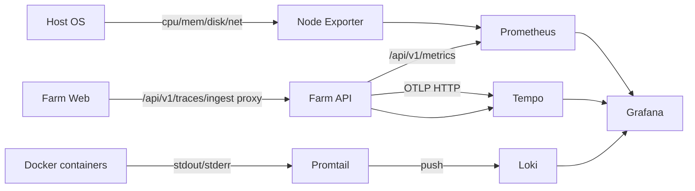

# Observability

Farm includes a fully integrated observability stack for monitoring API performance, tracking errors, inspecting distributed traces, and aggregating logs from all containers. The stack is **opt-in** and runs alongside the main application via a Docker Compose override.

## Architecture



| Component     | Purpose                                    | Port  |
|---------------|--------------------------------------------|-------|
| Prometheus    | Metrics collection and storage             | 9090  |
| Tempo         | Distributed trace storage                  | 3200  |
| Loki          | Log aggregation and storage                | 3100  |
| Promtail      | Log collector (Docker container logs)      | —     |
| Node Exporter | Host infrastructure metrics                | 9100  |
| Grafana       | Dashboards and visualization               | 3002  |

## Quick Start

Start the full observability stack with one command:

```bash
make up-observability
```

This launches the base stack (PostgreSQL, Redis, API) plus Prometheus, Tempo, Loki, Promtail, Node Exporter, and Grafana. The API container is automatically configured with:

- `OTEL_ENABLED=true` — enables OpenTelemetry trace export
- `OTEL_EXPORTER_ENDPOINT=http://tempo:4318/v1/traces` — sends traces to Tempo
- `LOKI_URL=http://loki:3100` — Loki endpoint for the Farm log proxy

### Accessing the Dashboards

| Service       | URL                          |
|---------------|------------------------------|
| Grafana       | <http://localhost:3002>      |
| Prometheus    | <http://localhost:9090>      |
| Tempo         | <http://localhost:3200>      |
| Loki          | <http://localhost:3100>      |
| Node Exporter | <http://localhost:9100>      |
| Farm API      | <http://localhost:3000/api>  |

Grafana starts with anonymous access enabled (no login required) for local development convenience.

### Stopping the Stack

```bash
make down-observability
```

## Pre-Configured Dashboards

The stack ships with three dashboards that are provisioned automatically.

### Farm API Overview

Monitors the NestJS application in real time.

#### Request Rate

- **Total request rate** (requests per second) across all endpoints
- **Error request rate** (5xx responses per second)
- **Per-route breakdown** by HTTP method and route pattern

#### Latency

- **p50, p95, p99 percentiles** of request duration
- **Average response time** as a stat panel
- **Duration heatmap** showing the distribution of response times

#### Error Rate

- **Error rate percentage** (5xx / total) with color-coded thresholds:
    - Green: < 1%
    - Yellow: 1% — 5%
    - Red: > 5%

#### Traces

- **Recent traces table** from Tempo, showing the latest 20 traces for `farm-api` and `farm-web` services. Click a trace ID to view the full span waterfall.

#### Business Metrics

- **Pipeline Executions Rate** — `pipeline_executions_total` by status (success / failure / cancelled)
- **Component Operations Rate** — `component_operations_total` by operation (create / update / delete)
- **Deployment Operations Total** — `deployment_operations_total` stat panel by operation and status

---

### Farm — Application Logs

Aggregates container logs collected by Promtail from all running Farm services.

| Panel | Description |
|---|---|
| Log Rate (lines/min) | Time series of log throughput per container |
| Error Rate (lines/min) | Time series of `level=error` logs per container |
| Error Count (last 1h) | Stat panel — total error log lines in the last hour |
| Warn Count (last 1h) | Stat panel — total warn log lines in the last hour |
| Total Logs (last 1h) | Stat panel — all log lines in the last hour |
| API Logs — farm-api | Live log panel filtered to `container="farm-api"` |
| All Container Logs | Live log panel showing all Farm containers |

Logs are labeled with `project=farm`, `container`, `service`, `level`, and `context` (Winston field). Use these labels in LogQL to filter by container or log level.

---

### Farm — Infrastructure

Host-level metrics from Node Exporter.

| Panel | Description |
|---|---|
| CPU Usage % | Time series of total host CPU utilization |
| Memory Usage % | Time series of host memory utilization |
| CPU — Current | Stat panel — current CPU % |
| Memory — Current | Stat panel — current memory % |
| Total Memory | Stat panel — total RAM installed |
| Disk Read/Write (bytes/s) | Time series of disk I/O throughput |
| Network Traffic (bytes/s) | Time series of network receive/transmit |
| Disk Usage % | Bar gauge per filesystem mount point |

---

## Log Collection

Promtail uses Docker service discovery (`docker_sd_configs`) to automatically collect stdout/stderr from every running Farm container. Logs are pushed to Loki in real time.

### Labels applied to all log streams

| Label | Source |
|---|---|
| `container` | Docker container name (e.g. `farm-api`) |
| `service` | Docker Compose service name |
| `project` | Always `farm` |
| `job` | Always `docker` |
| `level` | Extracted from Winston JSON field (when present) |
| `context` | Extracted from Winston JSON field (when present) |

### Querying logs in Grafana Explore

```logql
# All logs from the API
{container="farm-api"}

# Error logs from all containers
{project="farm", level="error"}

# Logs from a specific NestJS context
{container="farm-api", context="HttpException"}
```

---

## Metrics Reference

The API exposes these custom Prometheus metrics at `GET /api/v1/metrics`:

### HTTP Metrics (auto-instrumented)

| Metric                             | Type      | Labels                           | Description                              |
|------------------------------------|-----------|----------------------------------|------------------------------------------|
| `http_requests_total`              | Counter   | `method`, `route`, `status_code` | Total HTTP requests received             |
| `http_request_duration_seconds`    | Histogram | `method`, `route`, `status_code` | Request duration in seconds              |

### Business Metrics

| Metric                          | Type    | Labels                    | Description                                 |
|---------------------------------|---------|---------------------------|---------------------------------------------|
| `pipeline_executions_total`     | Counter | `status`, `pipeline_id`   | Pipeline runs completed                     |
| `component_operations_total`    | Counter | `operation`               | Component create/update/delete              |
| `deployment_operations_total`   | Counter | `operation`, `status`     | Deployment create/update operations         |
| `team_operations_total`         | Counter | `operation`               | Team create/update/delete operations        |

In addition, all default Node.js process metrics are exposed (CPU, memory, event loop lag, GC).

### Example PromQL Queries

**Request rate over the last 5 minutes:**
```promql
sum(rate(http_requests_total{job="farm-api"}[5m]))
```

**95th percentile latency by route:**
```promql
histogram_quantile(0.95, sum by (le, route) (rate(http_request_duration_seconds_bucket{job="farm-api"}[5m])))
```

**Error rate as a percentage:**
```promql
sum(rate(http_requests_total{job="farm-api", status_code=~"5.."}[5m])) / sum(rate(http_requests_total{job="farm-api"}[5m]))
```

**Host CPU usage:**
```promql
100 - (avg by(instance) (rate(node_cpu_seconds_total{mode="idle"}[2m])) * 100)
```

**Host memory usage:**
```promql
100 * (1 - (node_memory_MemAvailable_bytes / node_memory_MemTotal_bytes))
```

## Tracing

When `OTEL_ENABLED=true`, the API exports distributed traces via OpenTelemetry (OTLP HTTP protocol). The auto-instrumentations cover:

- **HTTP** -- incoming and outgoing HTTP requests
- **Express** -- route-level spans for each controller handler
- **TypeORM** -- database query spans with SQL statements

### Log-Trace Correlation

In production mode, Winston log entries automatically include `trace_id` and `span_id` fields. You can use these values to jump from a log entry in your aggregator directly to the corresponding trace in Grafana/Tempo.

### Configuring a Custom Trace Backend

To send traces to a different backend (Jaeger, Datadog, New Relic), update the `OTEL_EXPORTER_ENDPOINT` environment variable:

```yaml
# docker-compose.observability.yml
services:
  api:
    environment:
      OTEL_EXPORTER_ENDPOINT: "http://your-collector:4318/v1/traces"
```

## Configuration Reference

| Environment Variable        | Default                                   | Description                              |
|-----------------------------|-------------------------------------------|------------------------------------------|
| `OTEL_ENABLED`              | `false`                                   | Enable OpenTelemetry trace export        |
| `OTEL_EXPORTER_ENDPOINT`    | `http://localhost:4318/v1/traces`          | OTLP HTTP endpoint for traces            |
| `OTEL_SERVICE_NAME`         | `farm-api`                                | Service name in trace metadata           |

## Frontend Tracing

The Next.js frontend (`farm-web`) ships with a complete browser-side OpenTelemetry setup.

### Browser SDK

`apps/web/src/lib/tracing.ts` bootstraps the `@opentelemetry/sdk-trace-web` SDK on first page load via the `<TracingInit />` component placed in the root layout. It registers auto-instrumentations for:

- **Fetch / XHR** — automatically injects `traceparent` headers into all outgoing API calls, linking browser spans to backend spans in Tempo
- **Document load** — captures navigation timing as a root span

Spans are exported via OTLP HTTP to `POST /api/v1/traces/ingest`, a lightweight NestJS proxy that forwards them to Tempo. This avoids CORS issues since the browser posts to the same origin as the API.

### Web Vitals

`apps/web/src/lib/web-vitals.ts` reports the five Core Web Vitals as OTel spans:

| Span name        | Metric | Attributes                          |
|------------------|--------|-------------------------------------|
| `web_vitals.lcp` | LCP    | `web_vital.value`, `web_vital.rating` |
| `web_vitals.cls` | CLS    | `web_vital.value`, `web_vital.rating` |
| `web_vitals.fid` | FID    | `web_vital.value`, `web_vital.rating` |
| `web_vitals.ttfb`| TTFB   | `web_vital.value`, `web_vital.rating` |
| `web_vitals.inp` | INP    | `web_vital.value`, `web_vital.rating` |

### Manual Spans

`apps/web/src/lib/otel-spans.ts` provides two typed helpers used throughout the frontend:

- **`startSpan(name, attributes?)`** — returns a `Span` for manual lifecycle control
- **`recordSpan<T>(name, fn, attributes?)`** — wraps a sync/async function, auto-sets `SpanStatusCode.OK/ERROR`, and always ends the span

Key spans currently instrumented:

| Span name                  | Triggered by                            | Attributes                          |
|----------------------------|-----------------------------------------|-------------------------------------|
| `auth.login`               | Login form submission                   | `auth.method`, `result`, `error.message` |
| `catalog.search`           | Search term change in catalog           | `search.query`, `search.results_count` |
| `catalog.component.view`   | Component detail page load              | `component.id`, `component.kind`    |
| `pipeline.run.trigger`     | Trigger run button click                | `pipeline.id`                       |
| `org.switch`               | Organization switcher selection         | `org.id`, `org.name`                |

### User Context

`apps/web/src/lib/otel-context.ts` stores the authenticated user identity and sets it as span attributes:

```typescript
// Called after successful login or org switch
setUserContext(userId, username, orgId?)

// Called on logout
clearUserContext()
```

This links all browser spans to the authenticated user, enabling filtering by user in Grafana/Tempo.


### Adding Custom Dashboards

Place JSON dashboard files in `observability/grafana/provisioning/dashboards/`. They are automatically loaded by Grafana on startup.

### Adding Alert Rules

Create a `observability/grafana/provisioning/alerting/` directory and add alert rule YAML files. See the [Grafana provisioning docs](https://grafana.com/docs/grafana/latest/administration/provisioning/) for the schema.

### Using External Prometheus

If you already have a Prometheus instance, point it at `http://<farm-host>:3000/api/v1/metrics` with a scrape config:

```yaml
scrape_configs:
  - job_name: "farm-api"
    metrics_path: "/api/v1/metrics"
    static_configs:
      - targets: ["<farm-host>:3000"]
```

---

## Observability Proxy Module (FARM-E27)

The `ObservabilityModule` (`apps/api/src/common/observability/`) exposes thin HTTP proxies that forward requests from the Farm UI to external observability tools (Prometheus, Jaeger/Tempo, Loki). It does not store or process data.

### Design principles

- **Thin proxy**: Forwards requests and returns responses as-is.
- **Graceful degradation**: Every method catches all errors and returns `{ error: '<tool> not available', data: null }` with HTTP 200.
- **Admin-only**: All endpoints require `@Roles('admin')`.

### Adding a new proxy method

```typescript
// 1. Add to ObservabilityService
async queryNewTool(params: Record<string, string>): Promise<unknown> {
  const baseUrl = this.configService.get<string>('newtool.url');
  try {
    const { data } = await firstValueFrom(
      this.httpService.get(`${baseUrl}/api/v1/endpoint`, { params }),
    );
    return data;
  } catch {
    return { error: 'NewTool not available', data: null };
  }
}

// 2. Add to ObservabilityController
@Get('newtool/query')
@Roles('admin')
@UseGuards(JwtAuthGuard, RolesGuard)
async queryNewTool(@Query() query: Record<string, string>) {
  return this.observabilityService.queryNewTool(query);
}
```

### AlertingRule module

`apps/api/src/modules/alerting/` — CRUD for PromQL-based alerting rules linked to components or environments. Registered as plugin `core-alerting`. Migration: `1773684432000-add-alerting-rules.ts`.

### WebSocket event broadcasting

Inject `EventsGateway` with `@Optional()` and call `this.eventsGateway?.server?.emit(FarmEvent.EVENT_NAME, payload)`.

The `FarmEvent` enum must be kept in sync between `packages/types/src/index.ts` and `apps/api/src/common/events/events.interfaces.ts`.
