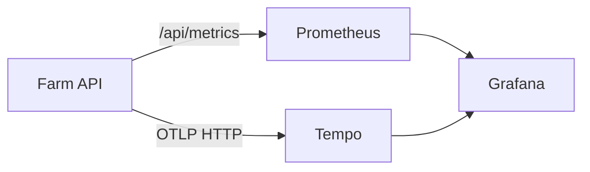

# Observability

Farm includes a fully integrated observability stack for monitoring API performance, tracking errors, and inspecting distributed traces. The stack is **opt-in** and runs alongside the main application via a Docker Compose override.

## Architecture



| Component   | Purpose                         | Port  |
|-------------|---------------------------------|-------|
| Prometheus  | Metrics collection and storage  | 9090  |
| Tempo       | Distributed trace storage       | 3200  |
| Grafana     | Dashboards and visualization    | 3002  |

## Quick Start

Start the full observability stack with one command:

```bash
make up-observability
```

This launches the base stack (PostgreSQL, Redis, API) plus Prometheus, Tempo, and Grafana. The API container is automatically configured with:

- `OTEL_ENABLED=true` -- enables OpenTelemetry trace export
- `OTEL_EXPORTER_ENDPOINT=http://tempo:4318/v1/traces` -- sends traces to Tempo

### Accessing the Dashboards

| Service    | URL                          |
|------------|------------------------------|
| Grafana    | <http://localhost:3002>      |
| Prometheus | <http://localhost:9090>      |
| Tempo      | <http://localhost:3200>      |
| Farm API   | <http://localhost:3000/api>  |

Grafana starts with anonymous access enabled (no login required) for local development convenience.

### Stopping the Stack

```bash
make down-observability
```

## Pre-Configured Dashboard

The stack ships with a **Farm API Overview** dashboard that is provisioned automatically. It includes the following panels:

### Request Rate

- **Total request rate** (requests per second) across all endpoints
- **Error request rate** (5xx responses per second)
- **Per-route breakdown** by HTTP method and route pattern

### Latency

- **p50, p95, p99 percentiles** of request duration
- **Average response time** as a stat panel
- **Duration heatmap** showing the distribution of response times

### Error Rate

- **Error rate percentage** (5xx / total) with color-coded thresholds:
    - Green: < 1%
    - Yellow: 1% -- 5%
    - Red: > 5%

### Traces

- **Recent traces table** from Tempo, showing the latest 20 traces for the `farm-api` service. Click a trace ID to view the full span waterfall.

## Metrics Reference

The API exposes these custom Prometheus metrics at `GET /api/metrics`:

| Metric                             | Type      | Labels                         | Description                              |
|------------------------------------|-----------|--------------------------------|------------------------------------------|
| `http_requests_total`              | Counter   | `method`, `route`, `status_code` | Total HTTP requests received             |
| `http_request_duration_seconds`    | Histogram | `method`, `route`, `status_code` | Request duration in seconds              |

In addition, all default Node.js process metrics are exposed (CPU, memory, event loop lag, GC).

### Example PromQL Queries

**Request rate over the last 5 minutes:**
```promql
sum(rate(http_requests_total{job="farm-api"}[5m]))
```

**95th percentile latency by route:**
```promql
histogram_quantile(0.95, sum by (le, route) (rate(http_request_duration_seconds_bucket{job="farm-api"}[5m])))
```

**Error rate as a percentage:**
```promql
sum(rate(http_requests_total{job="farm-api", status_code=~"5.."}[5m])) / sum(rate(http_requests_total{job="farm-api"}[5m]))
```

## Tracing

When `OTEL_ENABLED=true`, the API exports distributed traces via OpenTelemetry (OTLP HTTP protocol). The auto-instrumentations cover:

- **HTTP** -- incoming and outgoing HTTP requests
- **Express** -- route-level spans for each controller handler
- **TypeORM** -- database query spans with SQL statements

### Log-Trace Correlation

In production mode, Winston log entries automatically include `trace_id` and `span_id` fields. You can use these values to jump from a log entry in your aggregator directly to the corresponding trace in Grafana/Tempo.

### Configuring a Custom Trace Backend

To send traces to a different backend (Jaeger, Datadog, New Relic), update the `OTEL_EXPORTER_ENDPOINT` environment variable:

```yaml
# docker-compose.observability.yml
services:
  api:
    environment:
      OTEL_EXPORTER_ENDPOINT: "http://your-collector:4318/v1/traces"
```

## Configuration Reference

| Environment Variable        | Default                                   | Description                              |
|-----------------------------|-------------------------------------------|------------------------------------------|
| `OTEL_ENABLED`              | `false`                                   | Enable OpenTelemetry trace export        |
| `OTEL_EXPORTER_ENDPOINT`    | `http://localhost:4318/v1/traces`          | OTLP HTTP endpoint for traces            |
| `OTEL_SERVICE_NAME`         | `farm-api`                                | Service name in trace metadata           |

## Extending the Stack

### Adding Custom Dashboards

Place JSON dashboard files in `observability/grafana/provisioning/dashboards/`. They are automatically loaded by Grafana on startup.

### Adding Alert Rules

Create a `observability/grafana/provisioning/alerting/` directory and add alert rule YAML files. See the [Grafana provisioning docs](https://grafana.com/docs/grafana/latest/administration/provisioning/) for the schema.

### Using External Prometheus

If you already have a Prometheus instance, point it at `http://<farm-host>:3000/api/metrics` with a scrape config:

```yaml
scrape_configs:
  - job_name: "farm-api"
    metrics_path: "/api/metrics"
    static_configs:
      - targets: ["<farm-host>:3000"]
```

---

## Observability Proxy Module (FARM-E27)

The `ObservabilityModule` (`apps/api/src/common/observability/`) exposes thin HTTP proxies that forward requests from the Farm UI to external observability tools (Prometheus, Jaeger/Tempo, Loki). It does not store or process data.

### Design principles

- **Thin proxy**: Forwards requests and returns responses as-is.
- **Graceful degradation**: Every method catches all errors and returns `{ error: '<tool> not available', data: null }` with HTTP 200.
- **Admin-only**: All endpoints require `@Roles('admin')`.

### Adding a new proxy method

```typescript
// 1. Add to ObservabilityService
async queryNewTool(params: Record<string, string>): Promise<unknown> {
  const baseUrl = this.configService.get<string>('newtool.url');
  try {
    const { data } = await firstValueFrom(
      this.httpService.get(`${baseUrl}/api/v1/endpoint`, { params }),
    );
    return data;
  } catch {
    return { error: 'NewTool not available', data: null };
  }
}

// 2. Add to ObservabilityController
@Get('newtool/query')
@Roles('admin')
@UseGuards(JwtAuthGuard, RolesGuard)
async queryNewTool(@Query() query: Record<string, string>) {
  return this.observabilityService.queryNewTool(query);
}
```

### AlertingRule module

`apps/api/src/modules/alerting/` — CRUD for PromQL-based alerting rules linked to components or environments. Registered as plugin `core-alerting`. Migration: `1773684432000-add-alerting-rules.ts`.

### WebSocket event broadcasting

Inject `EventsGateway` with `@Optional()` and call `this.eventsGateway?.server?.emit(FarmEvent.EVENT_NAME, payload)`.

The `FarmEvent` enum must be kept in sync between `packages/types/src/index.ts` and `apps/api/src/common/events/events.interfaces.ts`.
