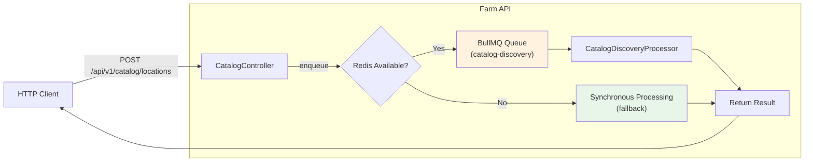
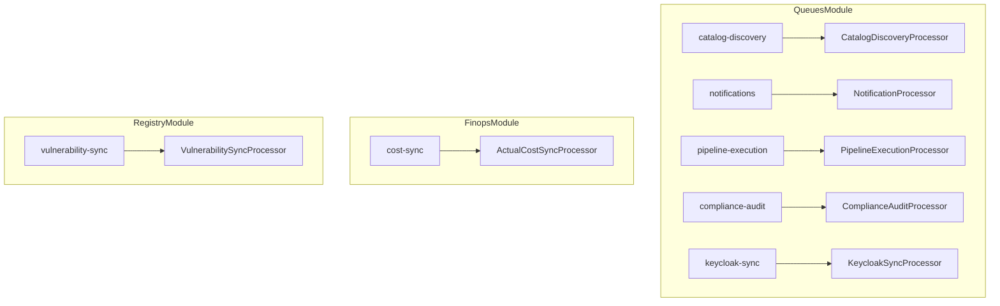
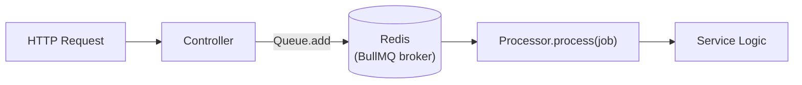

# Background Job Processing

Farm uses [BullMQ](https://docs.bullmq.io/) with Redis for asynchronous background job processing. This allows long-running or non-critical operations to run outside the HTTP request cycle.

## Available Queues

| Queue Name | Registered In | Processor | Purpose |
|---|---|---|---|
| `catalog-discovery` | `QueuesModule` | `CatalogDiscoveryProcessor` | Async YAML catalog ingestion from git repositories |
| `notifications` | `QueuesModule` | `NotificationProcessor` | Email and webhook notification delivery |
| `pipeline-execution` | `QueuesModule` | `PipelineExecutionProcessor` | Multi-stage pipeline job execution with WebSocket streaming |
| `compliance-audit` | `QueuesModule` | `ComplianceAuditProcessor` | Tag policy compliance scan for catalog components |
| `keycloak-sync` | `QueuesModule` | `KeycloakSyncProcessor` | Keycloak group-to-team membership synchronization |
| `cost-sync` | `FinopsModule` | `ActualCostSyncProcessor` | OpenCost cost data sync, triggered by `COST_SYNC_CRON` schedule |
| `vulnerability-sync` | `RegistryModule` | `VulnerabilitySyncProcessor` | Container image vulnerability scan (runs every 15 minutes) |

## How It Works

When a user calls `POST /api/v1/catalog/locations` to discover components from a git repository, the request is enqueued as a BullMQ job rather than processed synchronously. The `CatalogDiscoveryProcessor` picks up the job in the background, clones the repository, finds `catalog-info.yaml` files, and registers them.



Module-specific queues (`cost-sync`, `vulnerability-sync`) are registered by their own feature module and follow the same pattern — their processors run independently of `QueuesModule`.

If Redis is unavailable, the system falls back to synchronous processing automatically.



## Configuration

BullMQ connects to the same Redis instance used for caching. Configuration is via environment variables:

| Variable | Default | Description |
|---|---|---|
| `REDIS_HOST` | `localhost` | Redis server hostname |
| `REDIS_PORT` | `6379` | Redis server port |

In **test mode** (`NODE_ENV=test`), BullMQ is completely disabled to avoid Redis connection issues during testing. The `QueuesModule` returns an empty module in this case.

## Bull Board Dashboard

Farm includes [Bull Board](https://github.com/felixmosh/bull-board), a web-based UI for monitoring and managing BullMQ queues.

**URL:** `http://localhost:3000/api/admin/queues`

The dashboard allows you to:

- View pending, active, completed, and failed jobs
- Inspect job data and error stack traces
- Retry or remove failed jobs
- Monitor queue throughput in real time

## Adding a New Queue

1. Add the queue name to `QUEUE_NAMES` in `apps/api/src/common/queues/queue-names.ts`:

```typescript
export const QUEUE_NAMES = {
  // ... existing queues
  MY_QUEUE: "my-queue",
} as const;
```

2. Define the job data interface and processor in your feature module:

```typescript
import { Processor, WorkerHost } from "@nestjs/bullmq";
import { Job } from "bullmq";
import { QUEUE_NAMES } from "../../common/queues/queue-names";

export interface MyJobData {
  someField: string;
}

@Processor(QUEUE_NAMES.MY_QUEUE)
export class MyProcessor extends WorkerHost {
  async process(job: Job<MyJobData>): Promise<void> {
    // Process the job
  }
}
```

3. Register the queue in `QueuesModule` (`apps/api/src/common/queues/queues.module.ts`):

```typescript
BullModule.registerQueue(
  { name: QUEUE_NAMES.CATALOG_DISCOVERY },
  { name: QUEUE_NAMES.NOTIFICATIONS },
  { name: QUEUE_NAMES.MY_QUEUE },  // add here
),
```

4. Add the processor to the module's providers and register it with Bull Board.

5. Inject the queue in your service:

```typescript
constructor(
  @Optional() @InjectQueue(QUEUE_NAMES.MY_QUEUE) private readonly myQueue?: Queue,
) {}

async enqueueWork(data: MyJobData): Promise<void> {
  await this.myQueue?.add("job-name", data);
}
```

## Architecture



The queue acts as a buffer between the HTTP layer and the processing logic. This provides:

- **Non-blocking responses**: The API returns immediately with a job ID
- **Retry logic**: Failed jobs can be retried automatically
- **Concurrency control**: Limit how many jobs run in parallel
- **Visibility**: Bull Board shows job status and errors


