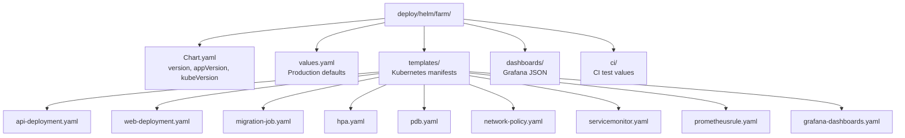

# Helm Chart Development Guide

This guide covers maintaining and developing the Farm Helm Chart (`deploy/helm/farm/`). The chart packages Farm for Kubernetes deployment with production-ready defaults, observability integration, and security hardening.

## Overview

The Farm Helm Chart:

- **Namespace**: `deploy/helm/farm/`
- **Chart name**: `farm`
- **Artifact Hub**: Published as OCI artifact to GitHub Container Registry (`ghcr.io/ops-talks/helm-charts/farm`)
- **Type**: Application chart
- **Minimum Kubernetes**: 1.26+ (HPA autoscaling/v2 GA requirement)
- **Current version**: 0.25.15 (chart version, bumped independently from appVersion)
- **Current appVersion**: 0.25.14 (Farm application version)

## Chart Structure

```text
deploy/helm/farm/
  Chart.yaml                  # Chart metadata, dependencies, version, changelog
  Chart.lock                  # Locked subchart versions (auto-generated)
  values.yaml                 # Default configuration values
  values-dev.yaml             # Development overrides (bundled PostgreSQL/Redis)
  values.schema.json          # JSON schema for values validation
  README.md                   # User-facing deployment and configuration guide
  .helmignore                 # Files excluded from chart packages
  charts/                     # Pulled subchart dependencies (postgresql, redis)
  templates/
    api/                      # Farm API (NestJS backend)
      deployment.yaml
      service.yaml
      configmap.yaml          # Non-sensitive environment variables
      secret.yaml             # (optional) Sensitive vars if not using existingSecret
      ingress.yaml
      hpa.yaml                # Horizontal Pod Autoscaler
      pdb.yaml                # Pod Disruption Budget
      serviceaccount.yaml
      networkpolicy.yaml
    web/                      # Farm Web (Next.js frontend)
      deployment.yaml
      service.yaml
      configmap.yaml
      ingress.yaml
      hpa.yaml
      pdb.yaml
      serviceaccount.yaml
      networkpolicy.yaml
    migration-job.yaml        # Pre-install hook: database schema migrations
    migration-config.yaml     # ConfigMap for migration Job
    migration-secret.yaml     # Secret for migration Job credentials
    seed-job.yaml             # Post-install hook: seed demo data
    tests/
      test-api-health.yaml    # Helm test hook: API health check
      test-web-health.yaml    # Helm test hook: Web health check
      test-db-redis.yaml      # Helm test hook: Database and Redis connectivity
    ingress-api.yaml          # API Ingress (split from unified template)
    ingress-web.yaml          # Web Ingress
    servicemonitor.yaml       # Prometheus Operator ServiceMonitor
    prometheusrule.yaml       # PrometheusRule: SLO and alert rules
    grafana-dashboards.yaml   # ConfigMaps for Grafana dashboard sidecar
    observability.yaml        # Observability resources (OpenTelemetry, Pyroscope, Faro)
    NOTES.txt                 # Helm installation notes (printed to console)
  ci/
    kind-values.yaml          # Values for KinD chart-testing (disables migrations; seeding is enabled)
  dashboards/                 # Grafana dashboard JSON files
    farm-api.json
    farm-infra.json
    farm-logs.json
    farm-rum.json
    farm-slo.json
    farm-traces.json
```



## Chart Metadata

### Chart.yaml

The chart version is **independent** from the application version:

```yaml
version: 0.25.15         # Chart version — SemVer for Helm releases
appVersion: "0.25.14"    # Farm application version
```

**Automated chart version bumping**:

Application releases (via `release-it`) call `scripts/bump-helm-chart-version.sh` in the `after:bump` hook. This script performs an independent **patch** increment of the chart version — it does not mirror `appVersion`. Minor and major chart version bumps must be performed manually before submitting a PR.

```bash
# Manual patch bump (same as the script does automatically):
bash scripts/bump-helm-chart-version.sh deploy/helm/farm/Chart.yaml
bash scripts/bump-helm-chart-version.sh deploy/helm/observability/Chart.yaml
```

The script validates that the current version matches `x.y.z` semver before proceeding. Pre-release or RC tags (e.g., `1.0.0-rc.1`) are not supported by the automated bump — perform those manually.

**Versioning Policy**:

- **Patch bump** (0.3.10 → 0.3.11) — Template fixes, bug fixes, non-breaking values changes
- **Minor bump** (0.3.0 → 0.4.0) — New features, new values keys (backward compatible)
- **Major bump** (0.3.0 → 1.0.0) — Breaking changes to values schema

**Trigger bump on**:

- Any modification to `templates/`, `values.yaml`, `values.schema.json`, `README.md`, `Chart.yaml`, or `ci/`
- Subchart dependency updates (`Chart.lock` changes)

### Chart Dependencies

Farm uses two Bitnami subcharts (optional):

```yaml
dependencies:
  - name: postgresql
    version: "18.6.10"
    repository: https://charts.bitnami.com/bitnami
    condition: postgresql.enabled
  - name: redis
    version: "25.5.3"
    repository: https://charts.bitnami.com/bitnami
    condition: redis.enabled
```

Update subchart versions:

```bash
cd deploy/helm/farm
helm repo update
helm dependency update    # Downloads and locks subcharts in Chart.lock
```

Commit the updated `Chart.lock` and bump chart version.

## Values Schema

`values.schema.json` enforces configuration validity. It uses JSON Schema Draft 7 with:

- Required fields (e.g., `api.image.repository`, `web.image.repository`)
- Type constraints (e.g., `replicaCount` is integer, min 1)
- Pattern validation (e.g., `imagePullPolicy` enum: `IfNotPresent`, `Always`, `Never`)
- Additionals properties disabled (`additionalProperties: false`) to catch typos in override files

**Update schema**:

1. When adding a new values key
2. When changing key type or constraints
3. When removing a key (mark as removed in comments)

**Validate schema**:

```bash
# Run inside CI (schema-validation step in helm-lint.yml)
# or locally with a JSON validator
npm install -g ajv-cli
ajv validate -s deploy/helm/farm/values.schema.json -d deploy/helm/farm/values.yaml
```

## Template Development

### Naming Conventions

- **Deployment names**: `{{ include "farm.fullname" . }}-api`, `{{ include "farm.fullname" . }}-web`
- **Labels**: Use the helper `{{ include "farm.labels" . }}` which includes:
  - `app.kubernetes.io/name=farm` or `farm-api` / `farm-web`
  - `app.kubernetes.io/instance={{ .Release.Name }}`
  - `app.kubernetes.io/version={{ .Chart.AppVersion }}`
  - `app.kubernetes.io/managed-by=Helm`
  - `helm.sh/chart={{ .Chart.Name }}-{{ .Chart.Version | replace "+" "_" }}`
- **Component labels**: Add `app.kubernetes.io/component: api` or `web` for service selectors
- **Test hook labels**: Use `app.kubernetes.io/component: test-*` (generic chart labels, not component-specific) to avoid matching service selectors

### Common Patterns

#### Conditional Resources

Use `.Values.key.enabled`:

```yaml
{{- if .Values.api.autoscaling.enabled }}
apiVersion: autoscaling/v2
kind: HorizontalPodAutoscaler
metadata:
  name: {{ include "farm.fullname" . }}-api
spec:
  # ...
{{- end }}
```

#### Image Pull Policy

Always use `imagePullPolicy` from values to allow override:

```yaml
image:
  repository: {{ .Values.api.image.repository }}
  tag: {{ .Values.api.image.tag | default .Chart.AppVersion }}
  pullPolicy: {{ .Values.api.image.pullPolicy }}
```

#### Secret Management

Support both generated secrets and external secrets:

```yaml
{{- if .Values.api.existingSecret }}
envFrom:
  - secretRef:
      name: {{ .Values.api.existingSecret }}
{{- else }}
env:
  - name: JWT_SECRET
    valueFrom:
      secretKeyRef:
        name: {{ include "farm.fullname" . }}-api
        key: JWT_SECRET
{{- end }}
```

#### Init Containers and Hooks

Use Helm hook weights for deterministic ordering:

- `pre-install` / `pre-upgrade` (weight: -20 to -1):
  - migration-job.yaml (weight: -1) — runs before regular resources
  - migration-config.yaml (weight: -10)
  - migration-secret.yaml (weight: -8)
- Regular resources (implicit weight: 0) — Deployment, Service, ConfigMap, Secret
- `post-install` / `post-upgrade` (weight: 1+):
  - seed-job.yaml (weight: 1) — runs after deployments succeed (dev/staging only)
  - bootstrap-job.yaml (weight: 2) — creates the first admin user (production-safe)
- `test` (Helm test hook):
  - test-*.yaml — runs on `helm test` command

Example annotation:

```yaml
metadata:
  annotations:
    helm.sh/hook: pre-install
    helm.sh/hook-weight: "-1"
    helm.sh/hook-delete-policy: before-hook-creation,hook-succeeded
```

#### Security Context

Pod-level `securityContext` example:

```yaml
securityContext:
  runAsNonRoot: true
  runAsUser: 1001
  fsGroup: 1001
  allowPrivilegeEscalation: false
  capabilities:
    drop: ["ALL"]
  readOnlyRootFilesystem: true
```

Container-level overrides (e.g., for init containers with different UIDs):

```yaml
initContainers:
  - name: wait-for-db
    securityContext:
      runAsUser: 65534  # nobody
    # ...
containers:
  - name: api
    securityContext:
      runAsUser: 1001   # nextjs user
    # ...
```

**Important**: Numeric UIDs are required when `runAsNonRoot: true` at pod level. String usernames (e.g., `curl_user` in `curlimages/curl`) cause `CreateContainerConfigError`.

## CI/CD Pipeline

### Helm Lint and Validation

**Workflow**: `.github/workflows/helm-lint.yml`

Runs on:
- Pull request (paths: `deploy/helm/**`, `.github/workflows/helm-lint.yml`)
- Manual dispatch (`workflow_call`)

Steps:

1. **Chart Testing (ct) lint** — Lints chart YAML, checks `values-*` schemas
   ```bash
   ct lint --config deploy/helm/ct.yaml
   ```

2. **Artifact Hub (ah) lint** — Validates Chart.yaml annotations, README format, schema completeness
   ```bash
   ah lint
   ```

3. **Helm dependency build** — Downloads and validates subcharts
   ```bash
   helm dependency build
   ```

4. **Chart-Testing KinD install** — Deploys chart to temporary KinD cluster with `ci/kind-values.yaml`
   ```bash
   ct install --config deploy/helm/ct.yaml
   ```

5. **Helm test** — Runs Helm test hook pods (health checks)
   ```bash
   helm test <release-name>
   ```

**Failure modes**:

- `ct lint` fails → invalid YAML or schema violations
- `ah lint` fails → missing/invalid annotations, broken README sections
- `ct install` fails → deployment errors, test hook failures
- `helm test` fails → health check pods timeout or non-zero exit

### Chart Publishing

**Workflow**: `.github/workflows/helm-publish.yml`

Runs on:
- Push to `main` (paths: `deploy/helm/farm/Chart.yaml` changed)
- Manual dispatch

Steps:

1. **Build chart package**
   ```bash
   helm package deploy/helm/farm --destination /tmp/packages/
   ```

2. **Sign with cosign (keyless)**
   ```bash
   cosign sign --yes \
     ghcr.io/ops-talks/helm-charts/farm:<VERSION>
   ```

3. **Push to OCI registry (GHCR)**
   ```bash
   helm push /tmp/packages/farm-<VERSION>.tgz \
     oci://ghcr.io/ops-talks/helm-charts
   ```

Result: Chart published as `ghcr.io/ops-talks/helm-charts/farm:<VERSION>`

**Manual publish** (if needed):

```bash
helm registry login ghcr.io -u <USERNAME> -p <GH_PAT>
helm dependency build deploy/helm/farm
helm package deploy/helm/farm
helm push farm-0.3.11.tgz oci://ghcr.io/ops-talks/helm-charts

# Sign with cosign (requires COSIGN_EXPERIMENTAL=1)
COSIGN_EXPERIMENTAL=1 cosign sign \
  --yes \
  ghcr.io/ops-talks/helm-charts/farm:0.3.11
```

## Making Changes

> **Version bump is mandatory for every change to any file under `deploy/helm/farm/` or
> `deploy/helm/observability/`, including `README.md`, `Chart.yaml` annotations, and
> `ci/` files.** The CI pipeline runs `ct lint` with `check-version-increment: true`,
> which compares against the `main` branch. Any diff without a version bump fails the
> pipeline. Run `make helm-lint` locally before pushing to catch this immediately.

### Adding a New Template

1. Create the file in `templates/` (e.g., `templates/api/custom-resource.yaml`)
2. Use existing helpers (`farm.fullname`, `farm.labels`)
3. Add configuration keys to `values.yaml` with sensible defaults
4. Update `values.schema.json` to validate new keys
5. Add conditional flag if the resource is optional:
   ```yaml
   {{- if .Values.customResource.enabled }}
   # template content
   {{- end }}
   ```
6. Document in `README.md` under the appropriate section
7. Update `Chart.yaml` version (patch bump)

### Modifying an Existing Template

1. Edit the template file
2. If adding a new values key:
   - Add to `values.yaml`
   - Add to `values.schema.json`
   - Document in `README.md`
3. Test locally with KinD:
   ```bash
   helm install farm deploy/helm/farm -f deploy/helm/farm/ci/kind-values.yaml \
     --namespace farm --create-namespace
   ```
4. Update `Chart.yaml` version (patch or minor bump depending on change)
5. Run linting before committing:
   ```bash
   make check    # includes helm-lint
   ```

### Updating Subcharts

`Chart.lock` stores a SHA-256 digest of the entire `dependencies:` block in `Chart.yaml`. **Any** modification to that block — including version bumps, adding a new dependency, adding `condition:`, `tags:`, or `alias:` to an existing one — invalidates the digest and requires regenerating the lock file. The CI `helm dependency build` step verifies this digest and fails with `the lock file (Chart.lock) is out of sync` if the lock is stale.

**Rule: after every change to `dependencies:` in `Chart.yaml`, run `helm dependency update` and commit `Chart.lock`.**

1. Modify `Chart.yaml` dependencies as needed:
   ```yaml
   dependencies:
     - name: postgresql
       version: "18.6.10"      # version bump
       condition: postgresql.enabled  # added condition
   ```
2. Regenerate the lock file:
   ```bash
   helm dependency update deploy/helm/farm
   # or for the observability chart:
   helm dependency update deploy/helm/observability
   ```
3. Commit both `Chart.yaml` and `Chart.lock`
4. Test with KinD
5. Bump chart version

> **Common mistake**: adding `condition:` or `alias:` fields to an existing dependency without running `helm dependency update` afterward. These fields change the digest even though the chart versions are unchanged, causing `helm dependency build` to fail in CI.

### Updating Chart Annotations

Chart metadata for Artifact Hub goes in `Chart.yaml` under `annotations`:

```yaml
annotations:
  artifacthub.io/license: Apache-2.0
  artifacthub.io/category: integration-delivery
  artifacthub.io/links: |
    - name: Source
      url: https://github.com/Ops-Talks/farm
  artifacthub.io/changes: |
    - kind: added
      description: "New feature X"
    - kind: fixed
      description: "Fixed bug Y"
```

**Change kinds**: `added`, `changed`, `deprecated`, `removed`, `fixed`, `security`

Always update `artifacthub.io/changes` when bumping chart version — this is visible on Artifact Hub and in release notes.

## Testing

### Local Testing with Docker Compose

```bash
# Start Farm locally (API + PostgreSQL)
make up-docker

# Check health
make healthcheck

# Access
curl http://localhost:3000/api/health
curl http://localhost:3001
```

### Local Testing with KinD

```bash
# Build KinD cluster
make kind-infra

# Build Docker images from current branch
make kind-build

# Deploy Farm to KinD
make kind-deploy

# Run helm test
kubectl -n farm exec -it <pod-name> -- helm test farm

# Cleanup
make kind-clean
```

### Unit Tests

Backend unit tests (Jest):

```bash
cd apps/api
npm run test
```

Frontend unit tests (Vitest):

```bash
cd apps/web
npm run test
```

### E2E Tests

Backend E2E tests with SQLite in-memory:

```bash
cd apps/api
npm run test:e2e
```

Frontend Playwright tests:

```bash
cd apps/web
npm run test:e2e
```

## Admin Bootstrap

On a fresh production installation, no users exist by default. The `bootstrap-job.yaml` hook creates the first admin user from Helm values. It runs as a `post-install` hook (weight: 2, after migration at -1) and is idempotent — if the username or email already exists, the job exits cleanly.

### Enabling Bootstrap

Set the following values in your overlay:

```yaml
bootstrap:
  admin:
    enabled: true
    username: admin
    email: admin@example.com
    password: YourSecurePassword
    # Optional: create an organization and enroll the admin as OWNER.
    orgName: "Acme Corp"
```

The password is stored in a Kubernetes Secret and is hashed with bcrypt before being written to the database.

When `orgName` is set, the bootstrap job also creates an organization with a URL-friendly slug derived from the name and adds the admin as OWNER. This prevents the admin from being trapped in the org-creation screen on first login. The operation is idempotent: if the org already exists (matched by name or slug), it is reused and only the membership is created if missing.

### Production Notes

- Bootstrap only runs on `helm install`, not on `helm upgrade`. If you delete the admin user, re-create it via the API or by running a bootstrap Job manually.
- In production, prefer `api.existingSecret` to manage credentials outside the chart. In that case, add `ADMIN_USERNAME`, `ADMIN_EMAIL`, `ADMIN_PASSWORD`, and optionally `ADMIN_ORG_NAME` to your external secret and enable bootstrap with values only for `enabled: true`.
- The seed Job (`seed.enabled`) also creates an admin user (`admin/Admin1234`) with a "Farm Demo" organization and demo data — never enable the seed in production.
- In dev (`values-dev.yaml`), both `seed.enabled: true` and `bootstrap.admin.orgName: "Farm Demo"` are set. The seed runs first (weight: 1) and creates everything; the bootstrap (weight: 2) detects the existing user and org and skips both.

## Common Issues

### Issue: `ct install` fails with `CreateContainerConfigError`

**Cause**: Test hook pod uses non-numeric UID (e.g., `curl_user` in `curlimages/curl`) with pod-level `runAsNonRoot: true`.

**Solution**: Add explicit numeric `runAsUser` in container securityContext:

```yaml
securityContext:
  runAsUser: 100    # curl_user UID on alpine
```

### Issue: Migration Job times out with `DeadlineExceeded`

**Cause**: PostgreSQL subchart is slower to initialize than migration retry budget.

**Solution**: Add `wait-for-db` init container with exponential backoff, or increase `migration.activeDeadlineSeconds`.

### Issue: `helm lint` fails with "X field is required"

**Cause**: `values.schema.json` marks field as required but it is missing from `values.yaml`.

**Solution**: Either add the field to `values.yaml` or remove the `required` constraint from schema.

### Issue: `ah lint` fails with "invalid annotation"

**Cause**: Artifact Hub annotation has incorrect format or references non-existent field.

**Solution**: Check Artifact Hub schema. Annotations must be valid YAML and follow the documented format.

## References

- [Helm Documentation](https://helm.sh/docs/)
- [Chart Best Practices](https://helm.sh/docs/chart_best_practices/)
- [Kubernetes Security Best Practices](https://kubernetes.io/docs/concepts/security/pod-security-standards/)
- [Farm Helm Chart README](https://github.com/Ops-Talks/farm/blob/main/deploy/helm/farm/README.md)
- [Artifact Hub Metadata](https://artifacthub.io/docs/topics/metadata/)


