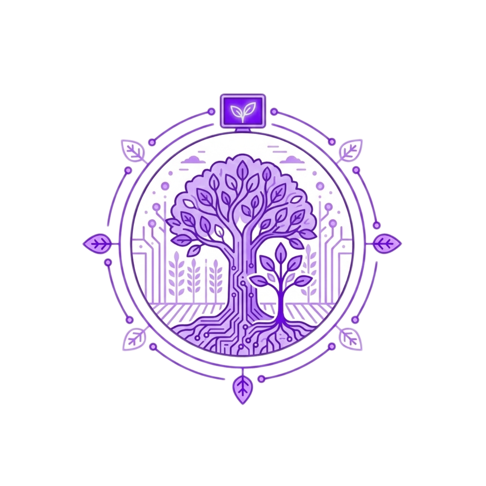

# Farm

<p align="center">
  
</p>

## What is Farm?

Farm is an open-source full stack portal providing a centralized hub for managing software components, technical documentation, and team infrastructure.

Farm enables engineering teams to:

- **Track Software Components**: Maintain a unified catalog of all software components including services, libraries, APIs, and websites
- **Manage Documentation**: Associate technical documentation with each component for easy discovery and maintenance
- **Handle Authentication**: Manage user access with role-based authentication and multi-tenant organization support
- **Observe Systems**: Monitor metrics, traces, and logs from a unified hub with native PromQL, Jaeger, and Loki integration
- **Run Pipelines**: Define and execute multi-stage pipelines with real-time log streaming via WebSocket
- **Manage Alerting**: Create and manage PromQL-based alerting rules linked to catalog components or environments
- **Track SLOs**: Define Service Level Objectives with error budget tracking and automated burn-rate alerts
- **Manage Incidents**: Coordinate incident response with timeline tracking, status transitions, and post-mortem workflows
- **Build Dashboards**: Create custom dashboards with configurable widget grids for real-time operational visibility
- **Scaffold Services**: Create new services from golden path templates with configurable variables and dry-run previews
- **Self-Service Environments**: Request ephemeral or persistent deployment environments through an approval workflow with TTL management
- **Manage Container Costs**: Track infrastructure spend per component and team via OpenCost integration with configurable budgets and automated sync
- **Scan Container Images**: Browse supported container registries, inspect image manifests, and surface vulnerability scan results per catalog component
- **Enforce Policies**: Evaluate Open Policy Agent policies on demand, persist results per component, and read Gatekeeper ConstraintTemplate violations from connected clusters
- **Discover and Understand**: Provide visibility into the software ecosystem within your organization

## Who is this documentation for?

This documentation is divided into sections targeting different audiences:

### End Users

If you are an end user looking to use Farm in your organization, start with the [User Guide](user-guide/index.md). This section covers:

- Getting started with Farm
- Using the component catalog
- Managing documentation
- Authentication and user management

### Developers and Contributors

If you are a developer looking to contribute to Farm or deploy it in your environment, check out the [Developer Guide](developer-guide/index.md). This section includes:

- Development environment setup
- Architecture overview
- Contribution guidelines
- Testing strategies

## Technology Stack

Farm is built with modern technologies:

| Layer | Technology | Purpose |
|---|---|---|
| **Backend** | [NestJS 11](https://docs.nestjs.com) | Progressive Node.js framework for building scalable server-side applications |
| **Backend** | [TypeORM](https://typeorm.io) | ORM for database access, migrations, and entity management |
| **Backend** | [PostgreSQL 16](https://www.postgresql.org) | Primary relational database |
| **Backend** | [BullMQ](https://docs.bullmq.io) | Redis-backed queue for background job processing (pipelines, notifications) |
| **Backend** | [Socket.IO](https://socket.io) | WebSocket gateway for real-time event broadcasting |
| **Frontend** | [Next.js 16](https://nextjs.org) | React framework with App Router and server components |
| **Frontend** | [React 19](https://react.dev) | UI component model |
| **Frontend** | [Tailwind CSS](https://tailwindcss.com) | Utility-first CSS framework |
| **Frontend** | [shadcn/ui](https://ui.shadcn.com) | Accessible component library built on Radix UI |
| **Shared** | [TypeScript](https://www.typescriptlang.org) | Strongly typed language for both frontend and backend |
| **Shared** | [@farm/types](https://github.com/Ops-Talks/farm) | Internal package for shared enums, types, and events |
| **Observability** | [Prometheus](https://prometheus.io) | Metrics collection and PromQL proxy |
| **Observability** | [Jaeger / Grafana Tempo](https://www.jaegertracing.io) | Distributed trace storage and waterfall viewer |
| **Observability** | [Loki](https://grafana.com/oss/loki) | Log aggregation and LogQL proxy |
| **Infrastructure** | [Docker / Docker Compose](https://docs.docker.com) | Container runtime and local development environment |
| **Infrastructure** | [Redis](https://redis.io) | Queue broker (BullMQ) and optional HTTP cache layer |

## Quick Start

The fastest way to get Farm running is using Docker and Docker Compose. This starts both the API and a PostgreSQL database.

```bash
# Clone the repository
git clone https://github.com/Ops-Talks/farm.git
cd farm

# Start the entire environment (API + Database)
make up-docker

# Check if everything is healthy
make healthcheck
```

The API server starts on port 3000 by default. You can access:

- **Health Endpoint**: `http://localhost:3000/api/health`
- **Interactive API Documentation (Swagger)**: `http://localhost:3000/api/docs`
- **Web UI**: `http://localhost:3001`

## License

Farm is licensed under the [GNU Affero General Public License v3.0](https://github.com/Ops-Talks/farm/blob/main/LICENSE).
