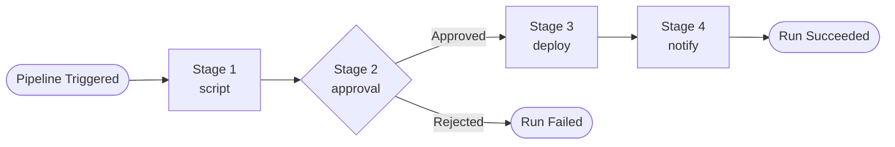
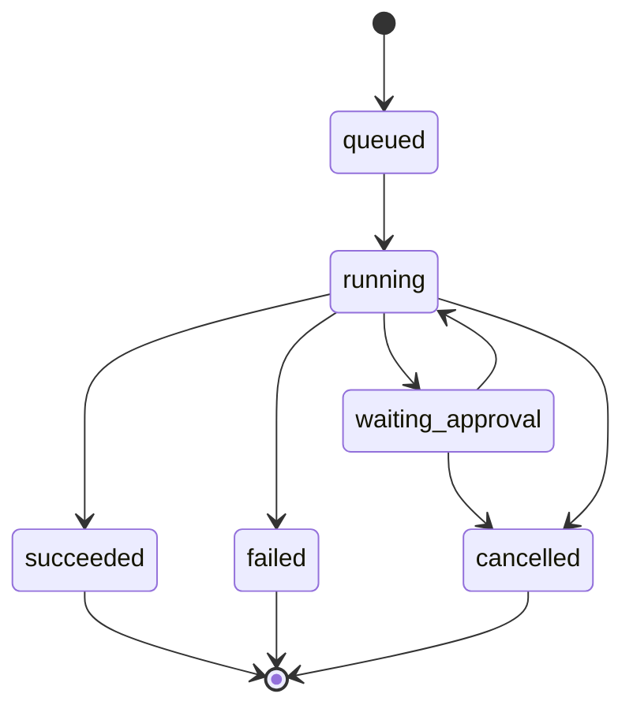

# Using Pipelines

Pipelines allow you to define, trigger, and monitor automated sequences of steps -- called stages -- directly from Farm. They are not the same as your external CI/CD pipelines (e.g., GitHub Actions); they are Farm-native automations that can orchestrate deployments, approvals, notifications, and custom scripts across your catalog components.

## Core Concepts

### Pipeline

A pipeline is a reusable definition that contains a name, an optional description, and an ordered list of stages. Pipelines are stored in Farm and can be triggered on demand.

### Stage

A stage is a single step within a pipeline. Each stage has a type that determines how it behaves:

| Type | Description |
|------|-------------|
| `script` | Executes a command or script |
| `approval` | Pauses execution and waits for a manual approval |
| `deploy` | Triggers a deployment of a catalog component to an environment |
| `notify` | Sends a notification (Slack, email, or webhook) |



### Pipeline Run

Every time a pipeline is triggered, Farm creates a **Pipeline Run** -- a record of that specific execution. Each run tracks its status, the result of every stage, accumulated logs, start time, finish time, and total duration.

### Run Status

| Status | Description |
|--------|-------------|
| `queued` | Run has been created and is waiting to be picked up |
| `running` | Run is actively executing stages |
| `waiting_approval` | Run is paused at an approval stage, waiting for a manual decision |
| `succeeded` | All stages completed successfully |
| `failed` | One or more stages encountered an error, or approval was rejected |
| `cancelled` | Run was cancelled before completion |



## Managing Pipelines

### Creating a Pipeline

```bash
curl -X POST http://localhost:3000/api/v1/pipelines \
  -H "Authorization: Bearer <token>" \
  -H "X-Organization-Id: <org-id>" \
  -H "Content-Type: application/json" \
  -d '{
    "name": "deploy-to-production",
    "description": "Runs tests, gets approval, and deploys to production",
    "stages": [
      {
        "id": "stage-1",
        "name": "Run tests",
        "type": "script",
        "order": 1,
        "config": { "command": "npm test" }
      },
      {
        "id": "stage-2",
        "name": "Approval gate",
        "type": "approval",
        "order": 2,
        "config": { "message": "Approve deployment to production?" }
      },
      {
        "id": "stage-3",
        "name": "Deploy user-service",
        "type": "deploy",
        "order": 3,
        "config": { "componentId": "<uuid>", "environmentId": "<uuid>" }
      },
      {
        "id": "stage-4",
        "name": "Notify team",
        "type": "notify",
        "order": 4,
        "config": { "channel": "#platform-team", "message": "Deployed successfully." }
      }
    ]
  }'
```

### Listing Pipelines

```bash
curl http://localhost:3000/api/v1/pipelines \
  -H "Authorization: Bearer <token>" \
  -H "X-Organization-Id: <org-id>"
```

Filter by organization:

```bash
curl "http://localhost:3000/api/v1/pipelines?organizationId=<org-uuid>" \
  -H "Authorization: Bearer <token>" \
  -H "X-Organization-Id: <org-id>"
```

### Getting a Pipeline

```bash
curl http://localhost:3000/api/v1/pipelines/<pipeline-id> \
  -H "Authorization: Bearer <token>" \
  -H "X-Organization-Id: <org-id>"
```

### Updating a Pipeline

```bash
curl -X PATCH http://localhost:3000/api/v1/pipelines/<pipeline-id> \
  -H "Authorization: Bearer <token>" \
  -H "X-Organization-Id: <org-id>" \
  -H "Content-Type: application/json" \
  -d '{ "description": "Updated description" }'
```

### Deleting a Pipeline

```bash
curl -X DELETE http://localhost:3000/api/v1/pipelines/<pipeline-id> \
  -H "Authorization: Bearer <token>" \
  -H "X-Organization-Id: <org-id>"
```

## Triggering and Monitoring

### Triggering a Run

```bash
curl -X POST http://localhost:3000/api/v1/pipelines/<pipeline-id>/trigger \
  -H "Authorization: Bearer <token>" \
  -H "X-Organization-Id: <org-id>"
```

Farm creates a `PipelineRun` with status `queued`, enqueues a background job, and returns the run record immediately.

### Real-Time Log Streaming

Pipeline logs are streamed in real time via WebSocket. Connect to the `/events` namespace and listen for `pipeline.log` events:

```javascript
import { io } from "socket.io-client";

const socket = io("http://localhost:3000/events", {
  auth: { token: "<jwt-token>" }
});

socket.on("pipeline.log", ({ runId, stage, message }) => {
  console.log(`[${stage}] ${message}`);
});

socket.on("pipeline.run.updated", (run) => {
  console.log(`Run ${run.id} is now ${run.status}`);
});
```

The Farm web UI connects automatically and displays logs in the pipeline run detail page.

### Listing Run History

```bash
curl http://localhost:3000/api/v1/pipelines/<pipeline-id>/runs \
  -H "Authorization: Bearer <token>" \
  -H "X-Organization-Id: <org-id>"
```

Returns the last 50 runs, ordered by most recent first.

### Getting a Specific Run

```bash
curl http://localhost:3000/api/v1/pipelines/<pipeline-id>/runs/<run-id> \
  -H "Authorization: Bearer <token>" \
  -H "X-Organization-Id: <org-id>"
```

## Managing Runs

### Approving or Rejecting a Run

When a pipeline includes an `approval` stage, the run pauses at that stage and enters `waiting_approval` status. An admin must approve or reject the run before execution can continue.

**Via the web UI**: Open the pipeline run detail page. When a run is in `waiting_approval` status, an approval banner appears showing the approval stage name. Click **Approve** to continue execution or **Reject** to fail the run.

**Via API:**

```bash
# Approve
curl -X POST http://localhost:3000/api/v1/pipelines/<pipeline-id>/runs/<run-id>/approve \
  -H "Authorization: Bearer <admin-token>" \
  -H "X-Organization-Id: <org-id>"

# Reject
curl -X POST http://localhost:3000/api/v1/pipelines/<pipeline-id>/runs/<run-id>/reject \
  -H "Authorization: Bearer <admin-token>" \
  -H "X-Organization-Id: <org-id>"
```

### Cancelling a Run

You can cancel a run that is in `queued`, `running`, or `waiting_approval` status.

**Via the web UI**: Open the run detail page and click **Cancel Run**.

**Via API:**

```bash
curl -X POST http://localhost:3000/api/v1/pipelines/<pipeline-id>/runs/<run-id>/cancel \
  -H "Authorization: Bearer <admin-token>" \
  -H "X-Organization-Id: <org-id>"
```

Cancellation takes effect at the next stage boundary. In-progress stage execution is not interrupted mid-command.

### Retriggering a Run

If a run has `failed` or `cancelled` status, you can trigger a fresh run of the same pipeline.

**Via the web UI**: Open the run detail page and click **Retrigger**.

**Via API** (creates a new run):

```bash
curl -X POST http://localhost:3000/api/v1/pipelines/<pipeline-id>/trigger \
  -H "Authorization: Bearer <token>" \
  -H "X-Organization-Id: <org-id>"
```

## Best Practices

- Keep stages focused on a single responsibility
- Use `approval` stages before any destructive or irreversible operations (production deployments, database migrations)
- Keep `notify` stages at the end so the team is informed of the final outcome

### Pipeline Naming

- Use descriptive, action-oriented names: `deploy-to-production`, `run-db-migration`, `release-user-service`
- Use lowercase letters and hyphens

### Relationship to the Catalog

Pipelines work best when linked to catalog components. Use the `deploy` stage `config.componentId` to reference the exact component being deployed, keeping your catalog and your automation in sync.

### Multi-Tenant Scoping

Set `organizationId` on your pipelines to scope them to a specific organization. Users can then filter pipelines by organization when listing.


