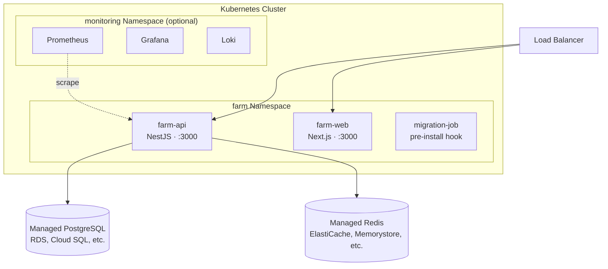

# Production Deployment Guide

This guide covers everything required to run Farm in a production environment. All default values in the codebase are designed for local development and must be overridden before going live.

---

## Pre-deployment Checklist

- [ ] Generate a strong `JWT_SECRET` (minimum 32 characters)
- [ ] Point `DATABASE_*` variables to a managed PostgreSQL instance
- [ ] Set `DATABASE_SYNC=false` and run migrations manually
- [ ] Set `NODE_ENV=production`
- [ ] Restrict `ALLOWED_ORIGINS` to your domain
- [ ] Change `SWAGGER_USER` and `SWAGGER_PASSWORD`
- [ ] Configure Redis (`REDIS_HOST`) for queues and real-time notifications
- [ ] Set `NEXT_PUBLIC_API_URL` on the frontend to the public API URL
- [ ] Run `GET /api/health` after deploy and confirm all indicators are `up`

### Reference Architecture



---

## Environment Variables

### API (`apps/api/.env` or container environment)

#### Required

| Variable | Example | Description |
|----------|---------|-------------|
| `NODE_ENV` | `production` | Enables strict validation (JWT_SECRET becomes required) |
| `JWT_SECRET` | *(see below)* | JWT signing secret — minimum 32 characters |
| `DATABASE_HOST` | `db.internal` | PostgreSQL host |
| `DATABASE_PORT` | `5432` | PostgreSQL port |
| `DATABASE_USER` | `farm` | PostgreSQL user |
| `DATABASE_PASSWORD` | *(strong password)* | PostgreSQL password |
| `DATABASE_NAME` | `farm` | PostgreSQL database name |
| `DATABASE_SYNC` | `false` | **Never set to `true` in production** — use migrations |

Generate a secure JWT secret:

```bash
openssl rand -hex 32
```

#### Recommended

| Variable | Recommended value | Description |
|----------|-------------------|-------------|
| `ALLOWED_ORIGINS` | `https://yourdomain.com` | CORS allowed origins — never use `*` in production |
| `JWT_EXPIRATION` | `900s` | Access token lifetime (15 min is more secure than the default 1 hour) |
| `THROTTLE_TTL` | `60000` | Rate limit window in milliseconds |
| `THROTTLE_LIMIT` | `30` | Max requests per window per IP |
| `SWAGGER_USER` | *(custom user)* | HTTP Basic Auth user for `/api/docs` |
| `SWAGGER_PASSWORD` | *(strong password)* | HTTP Basic Auth password for `/api/docs` |
| `LOG_LEVEL` | `warn` | Reduces log volume in production (`error`, `warn`, `info`) |
| `DATABASE_POOL_SIZE` | `20` | Connection pool size — tune based on load |

#### Redis (required for pipelines and real-time notifications)

| Variable | Example | Description |
|----------|---------|-------------|
| `REDIS_HOST` | `redis.internal` | Redis hostname — leave empty to disable queues |
| `REDIS_PORT` | `6379` | Redis port |
| `CACHE_TTL` | `60` | In-memory cache TTL in seconds |

Without Redis, pipeline execution queues and WebSocket notifications are disabled.

#### Email (optional)

| Variable | Example | Description |
|----------|---------|-------------|
| `SMTP_HOST` | `smtp.sendgrid.net` | SMTP server hostname |
| `SMTP_PORT` | `587` | SMTP port |
| `SMTP_SECURE` | `false` | Use TLS (`true` for port 465) |
| `SMTP_USER` | `apikey` | SMTP username |
| `SMTP_PASS` | *(API key)* | SMTP password or API key |
| `SMTP_FROM` | `Farm <noreply@empresa.com>` | Sender address shown in emails |

#### Observability (optional but recommended)

| Variable | Example | Description |
|----------|---------|-------------|
| `OTEL_ENABLED` | `true` | Enable OpenTelemetry tracing |
| `OTEL_EXPORTER_ENDPOINT` | `http://tempo:4318/v1/traces` | OTLP HTTP trace exporter endpoint |
| `OTEL_SERVICE_NAME` | `farm-api` | Service name in trace metadata |
| `PROMETHEUS_URL` | `http://prometheus:9090` | Prometheus endpoint for PromQL proxy |
| `GRAFANA_URL` | `https://grafana.yourdomain.com` | Grafana base URL shown in the observability dashboard |
| `JAEGER_URL` | `http://jaeger:16686` | Jaeger/Tempo UI URL for trace links |
| `LOKI_URL` | `http://loki:3100` | Loki endpoint for log aggregation proxy |

#### OAuth Social Login (optional)

| Variable | Example | Description |
|----------|---------|-------------|
| `GITHUB_CLIENT_ID` | `Ov23li...` | GitHub OAuth App client ID |
| `GITHUB_CLIENT_SECRET` | *(secret)* | GitHub OAuth App client secret |
| `GITHUB_CALLBACK_URL` | `https://api.yourdomain.com/api/v1/auth/github/callback` | GitHub redirect URI (must match OAuth App settings) |
| `GOOGLE_CLIENT_ID` | `123456-abc.apps.googleusercontent.com` | Google OAuth client ID |
| `GOOGLE_CLIENT_SECRET` | *(secret)* | Google OAuth client secret |
| `GOOGLE_CALLBACK_URL` | `https://api.yourdomain.com/api/v1/auth/google/callback` | Google redirect URI (must match GCP credentials) |

Leave all six empty to disable social login. See the [OAuth Social Login](../developer-guide/setup.md#oauth-social-login) section for instructions on creating the OAuth Apps.

#### CI/CD Integrations (optional)

| Variable | Example | Description |
|----------|---------|-------------|
| `SLACK_WEBHOOK_URL` | `https://hooks.slack.com/...` | Slack incoming webhook for pipeline notifications |
| `TEAMS_WEBHOOK_URL` | `https://outlook.office.com/...` | Microsoft Teams webhook for pipeline notifications |

Credentials for ArgoCD, CircleCI, Jenkins, and Travis CI are stored per-organization in the database (encrypted with AES-256-GCM) and managed through the Integration Settings page — no env vars required.

#### Kubernetes and Helm (optional)

| Variable | Example | Description |
|----------|---------|-------------|
| `KUBECONFIG_PATH` | `/etc/farm/kubeconfig` | Path to a kubeconfig file. Leave empty to use in-cluster service account |

#### Plugin System (optional)

| Variable | Default | Description |
|----------|---------|-------------|
| `PLUGINS_DIR` | `./plugins` | Directory scanned at startup for external plugin modules |

---

### Frontend (`apps/web/.env.local` or container environment)

| Variable | Example | Description |
|----------|---------|-------------|
| `NEXT_PUBLIC_API_URL` | `https://api.yourdomain.com/api` | Public API base URL used by the browser |
| `API_INTERNAL_URL` | `http://api:3000/api` | Internal API URL used by Next.js SSR (Docker networking) |
| `NEXT_PUBLIC_WS_URL` | `https://api.yourdomain.com` | WebSocket server base URL |
| `NEXT_PUBLIC_APP_VERSION` | `1.0.0` | Version string displayed in the UI |
| `NEXT_TELEMETRY_DISABLED` | `1` | Disables Next.js anonymous telemetry |

---

## Database Migrations

Never use `DATABASE_SYNC=true` in production. Schema changes must be applied through migrations:

```bash
# Apply all pending migrations
cd apps/api
npm run migration:run

# Revert the last migration if something goes wrong
npm run migration:revert

# Generate a new migration after entity changes (development only)
npm run migration:generate
```

Migration files live in `apps/api/src/migrations/`. Always commit migrations alongside the entity changes that require them.

---

## Docker Compose

The repository includes a production-ready Docker Compose setup:

```bash
# Start API + PostgreSQL + Redis
docker compose up -d

# Start full stack including Grafana, Prometheus, and Tempo
docker compose -f docker-compose.yml -f docker-compose.observability.yml up -d
```

For production, override the default credentials by creating a `.env` file at the repository root or by passing environment variables directly to your container runtime.

### Example `.env` for Docker Compose

```env
NODE_ENV=production
JWT_SECRET=<openssl rand -hex 32 output>
DATABASE_PASSWORD=strong_db_password
DATABASE_POOL_SIZE=20
ALLOWED_ORIGINS=https://yourdomain.com
SWAGGER_USER=ops
SWAGGER_PASSWORD=strong_swagger_password
REDIS_HOST=redis
NEXT_PUBLIC_API_URL=https://api.yourdomain.com/api
API_INTERNAL_URL=http://api:3000/api
NEXT_PUBLIC_WS_URL=https://api.yourdomain.com
```

---

## Kubernetes

Farm ships Helm charts under `charts/farm/`. See the [Helm Integration](helm-integration.md) guide for full deployment instructions.

```bash
helm upgrade --install farm ./charts/farm \
  --set api.env.NODE_ENV=production \
  --set api.env.JWT_SECRET="$(openssl rand -hex 32)" \
  --set api.env.DATABASE_HOST=postgres.namespace.svc.cluster.local \
  --set api.env.DATABASE_PASSWORD=strongpassword \
  --set api.env.ALLOWED_ORIGINS=https://yourdomain.com \
  -n farm --create-namespace
```

---

## Health Check

Verify the deployment is healthy after every release:

```bash
curl -fsS https://api.yourdomain.com/api/health
```

Expected response:

```json
{
  "status": "ok",
  "info": {
    "database": { "status": "up" },
    "memory_heap": { "status": "up" },
    "memory_rss": { "status": "up" },
    "storage": { "status": "up" }
  }
}
```

Any indicator with `"status": "down"` means a dependency is unreachable. Check database connectivity and Redis availability first.

---

## First Admin User

After the first deployment there are no admin users. The first user to register gets the `user` role. Promote them to admin directly in the database:

```sql
UPDATE users
SET roles = '["admin","user"]'
WHERE username = 'your_username';
```

All subsequent role management can be done through the API using an admin JWT.

---

## Security Hardening

- **TLS**: Terminate TLS at your load balancer or reverse proxy (nginx, Traefik, AWS ALB). The API itself does not handle TLS directly.
- **Swagger UI**: Restrict `/api/docs` at the network level if possible, in addition to the HTTP Basic Auth already in place. Consider disabling it entirely in production by not exposing the route.
- **Secrets management**: Use your platform's secret store (AWS Secrets Manager, HashiCorp Vault, Kubernetes Secrets) instead of plain `.env` files.
- **Database**: Use a dedicated PostgreSQL user with only the permissions required (`SELECT`, `INSERT`, `UPDATE`, `DELETE` on the `farm` database — no superuser).
- **Redis**: Enable authentication (`requirepass`) and restrict network access to the API container only.


